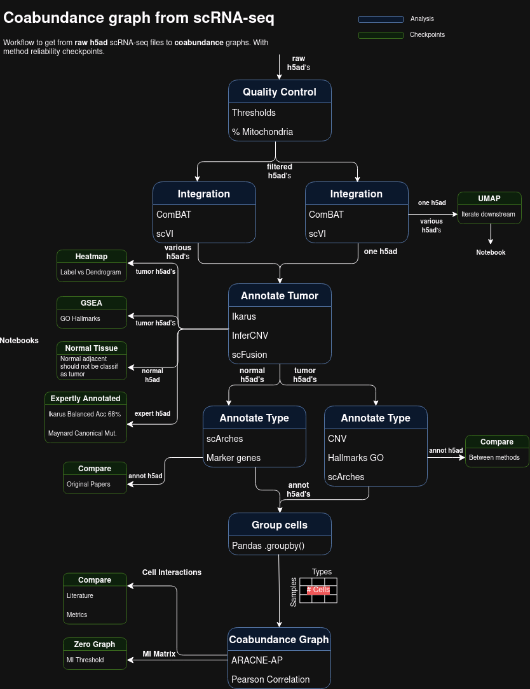

# LUCA Single-Cell Coabundance Networks Pipeline

The main objective of this project is to perform an ecological analysis of the cell types in NSCLC lung tumor tissues from scRNA-seq data, in both early and late tumor stages. We obtain coabundance metrics, specifically relying on Mutual Information (MI), as it captures non-linear correlations in the data, and the methodology in the [ARACNE-AP](https://github.com/califano-lab/ARACNe-AP) package ensures a smaller possibility of spurious correlations.

This repository serves as the unified Nextflow automation of the preprocessing, model training, annotation, and downstream analysis. It replaces the old Jupyter notebook workflow with a robust, scalable pipeline.



## Dataset Catalog (`metadata/dsets.csv`)

The datasets used in this pipeline are standardized and documented under [metadata/dsets.csv](file:///home/epaaso/REPOS/sc-luca-pipeline/metadata/dsets.csv). This CSV acts as the primary registry mapping quality control thresholds, platform chemistries, biological/clinical details, and publication DOIs for all integrated single-cell RNA-seq studies.

Key columns in the registry include:
- `id`: The unique name identifier of the dataset (e.g., `Chen_Zhang_2020_NSCLC`, `Kim_Lee_2020_LUAD`, `Zuani_2024_NSCLC`).
- `input_adata`: The expected local path to the raw/processed AnnData file.
- `min_counts`, `max_counts`, `min_genes`, `max_genes`, `max_pct_mito`: Quality control (QC) thresholds applied during preprocessing.
- `integrated cells n`: Total cells included from the study.
- `doi`, `journal`, `names`: Citation and publication registry information.
- `stage`, `disease`, `cell_sorting`, `prior_treatment`: Biological details and clinical variables of the dataset.

---

## Pipeline Execution Modes

The pipeline supports two execution models: the default auto-chained end-to-end workflow, or individual standalone workflows.

### 1. End-to-End Auto-Chained Pipeline (`PIPELINE` Mode)

This is the default execution workflow. It chains all stages together:
1. **Hyperparameter Search**: Runs hyperparameter optimization via Ray Tune over the SCVI model parameters.
2. **Config Extraction**: Identifies the best trial and exports the optimal settings.
3. **Atlas Training**: Merges the optimized parameters into the baseline configuration and trains a reference SCANVI model.
4. **Dataset Surgery**: Maps the query dataset onto the newly trained SCANVI atlas to perform annotation.

To run the complete chained pipeline:
```bash
# Run end-to-end pipeline locally
nextflow run main.nf -profile local

# Run end-to-end pipeline on Slurm GPU cluster
nextflow run main.nf -profile remote_gpu
```

### 2. Standalone Workflows

You can also run individual phases of the pipeline separately by using the `-entry` flag:

* **Atlas Generation (`ATLAS` Workflow)**: Trains the scVI/scANVI reference models to embed and cluster reference datasets.
  ```bash
  nextflow run main.nf -entry ATLAS -c configs/atlas_default.yaml -profile remote_gpu
  ```
* **Dataset Annotation (`SURGERY` Workflow)**: Annotates external query datasets via architectural surgery using a pre-trained reference model.
  ```bash
  nextflow run main.nf -entry SURGERY -c configs/surgery_default.yaml -profile local
  ```
* **Hyperparameter Tuning (`RAYTUNE` Workflow)**: Explores SCVI model parameter search spaces via Ray Tune.
  ```bash
  nextflow run main.nf -entry RAYTUNE -c configs/raytune_default.yaml -profile remote_gpu
  ```

*Note: The remaining phases—mutual information extraction, network generation with ARACNE-AP, and graph visualization—are currently **pending implementation** in the pipeline. Once implemented, they will be added as new workflows.*

---

## Automatic Dataset Downloading & Preprocessing

To make execution seamless and remote-friendly (especially on environments without access to local shared mounts like `/datos`), the pipeline automatically downloads and prepares input files if they do not exist locally:

1. **LUCA Reference Atlas**:
   - If the files `/data/luca_atlas/extended.h5ad` or `/data/luca_atlas/extended_tumor_hvg.h5ad` are missing, Nextflow will trigger `PREPARE_DATASET` for the `extended` or `extended_tumor_hvg` dataset.
   - The pipeline retrieves the full extended atlas directly from CELLxGENE's stable dataset asset portal (`https://datasets.cellxgene.cziscience.com/173984ce-d33a-46b6-ae96-4be47f6c67e8.h5ad`).
   - For `extended_tumor_hvg`, the script automatically subsets the downloaded atlas in memory to `tumor_primary` cells, filters for specific UICC stages (`I` through `IV`), excludes conflicting studies, filters for highly variable genes, and prepares raw counts.

2. **Query/Surgery Datasets**:
   - If the input query file specified for dataset surgery (e.g., `Bishoff`, `Hu`, `Zuani`, `Deng`) does not exist at its designated location, the pipeline automatically fetches the raw matrices/barcodes/features from their public endpoints (EBI BioStudies, Figshare, GEO, CodeOcean) and runs the corresponding filtering pipeline defined in `bin/download_and_preprocess_dataset.py` before executing the surgery mapping.

---

## Folder Structure

- `main.nf` - The primary Nextflow workflow definition containing the entry workflows (`ATLAS`, `SURGERY`, `RAYTUNE`, and `PIPELINE`).
- `nextflow.config` - Defines executor profiles (`local`, `remote_gpu`) and singularity bindings.
- `bin/` - Python scripts executed by Nextflow for the various workflows, including dataset retrieval and model training.
- `configs/` - Base YAML configurations for each workflow type.
- `metadata/` - Contains dataset catalog files like `dsets.csv`.
- `AGENTS.md` and `SKILLS.md` - Context for interacting with the AI agent system to develop or monitor the pipeline.
